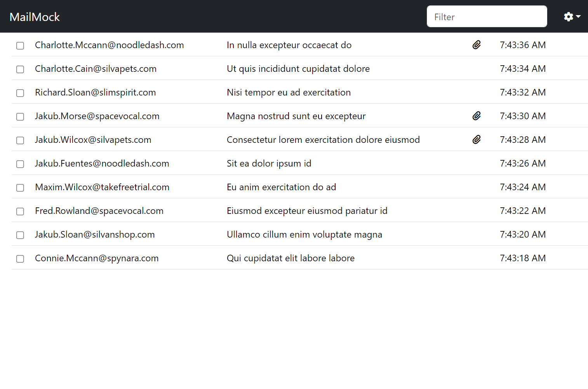
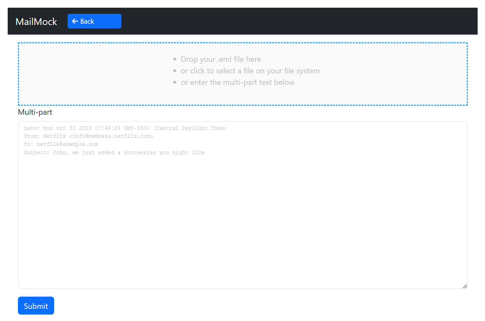

<h1>

MailMock - Fake Email server and client.
</h1>

MailMock is an email server and a Web based email client running in a Docker image.

This is typically used by developers and QA engineers to visualize the emails sent by their application.


<hr/>

<hr/>


## Port numbers

The Web application is hosted on port 7015.
The email server accepts connections on the standard ports:

| Protocol     | Default Port |
|--------------|--------------|
| Email client | 7015         |
| SMTP         | 25           |
| SMTPS        | 465          |
| POP3         | 110          |
| POP3S        | 995          |
| IMAP         | 143          |
| IMAPS        | 993          |

## MailMock in Docker

* Run MailMock: `docker run -p 7015:7015 -p 25:25 cdandoy/mail-mock`
* Open the email client: [http://localhost:7015/](http://localhost:7015/)
* Configure your application to send emails to the SMTP port:

```
mail.smtp.host=localhost
mail.smtp.port=25
```

## MailMock in Docker Compose

Add the following to your `docker-compose.yml` file:

```yaml
services:
  email:
    image: "cdandoy/mail-mock:latest"
    ports:
      - "7015:7015"  # HTTP
      - "25:25"      # SMTP       
#      - "465:465"   # SMTPS
#      - "110:110"   # POP3
#      - "995:995"   # POP3S
#      - "143:143"   # IMAP
#      - "993:993"   # IMAPS
```

